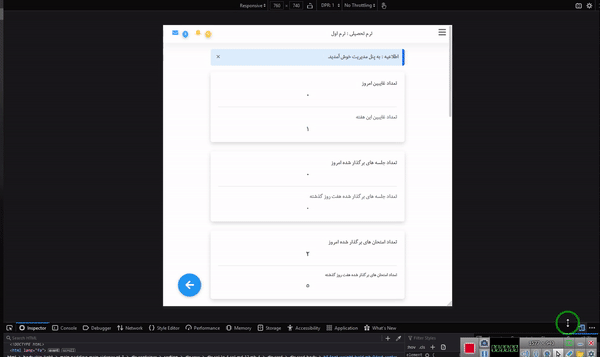
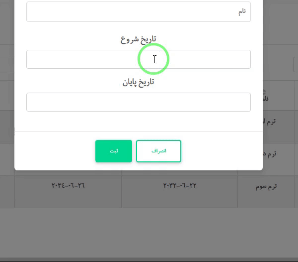

# mdb-rtl
demo version of mdb(material designe bootstrap) libarary im using , trying to complete it

  

  <h2> inputs </h2>
  

  

  <h2> data tables </h2>
  

  

  <h2>  alert </h2>
  

  

  <h2>  side-menu </h2>
  

  

  <h2>  persian date picker </h2>
  

  

  <h2>   	toast </h2>
  

